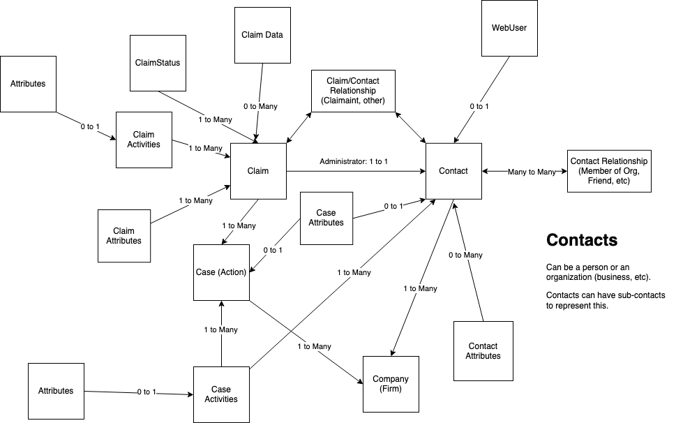

# CaseFunnel Concepts and Data Types

This primarily applies to the V2 API

Concepts:

- Company
- Contacts
- Cases
- Claims
- Activities
- Attributes

Data:

- Contact Properties
- Attributes
- Attribute Types
- Claim Data

## Concepts

### Contacts

Contacts represent individuals or organizations in CaseFunnel.  Contacts can be Claimaints, Administrators of Claims or Companies which is a group of Contacts.  Contacts can be related to one another.  Typically, the only relationship is "member" to show people that are in organizations.

Contacts "live" within a Company and can be related to 0 or many Claims directly.  Therefore, they are indirectly related to Cases.

### Cases

Cases represent a action or lawsuit that the company is potentially bringing to court.

The only direct data a Case has is a Name

### Claims

A claim is an instance of one or more claimants being part of a case.  

Currently, claims directly have no data except knowing the Administrator and 0 to many Claimaints of the Claim.

### Activities

Activities are the mechanism through which data is gathered from Contacts (as a Claim Administrator) into CaseFunnel.  They have a lifecycle and attributes directly associated.

#### Types

- Claim Activity - directly related to a Claim (indirectly related to a Case)
- Case Activity -  directly related to a Contact and a Case outside the scope of a Claim)

#### Lifecycle

- Open - new, assigned but not yet acted upon
- Submitted - the contact has submitted data that should be checked
- Accepted - the case handler has validated the data manually or automatically through workflow
- Partially Accepted - the case handler needs to pause workflow or otherwise pause the claim
- Rejected - the case handler rejects the submitted data.  Typically, another or same activity is assigned again (open)
- Deleted - hide the activity and no longer act upon it

### Clients vs Contacts/Claims

The notion of a "Client" is a single individual (Contact) that is bringing a Claim within a case themselves as a Claimant.  For many cases, this is enough detail.  However, there are cases where the Claim is being done on be half of someone else.  This is why a Claim now separates the Administrator and Claimant(s).

A Claim requires a single Administrator but can have zero to many Claimants as part of it.

The "old" Client style is where there is a Claim who's Administrator is also the sole Claimant.

## Data

### Contact Properties

This are basic data types that belong to Contacts.  This is usually personal information about an individual or company.  It could also be preferences such as GDPR settings.

These are the values that are typically searchable:

- Phone
- SecondaryPhone
- Email
- FirstName (for individual contacts)
- MiddleName (for individual contacts)
- LastName (for individual contacts)
- CompanyName (for company contacts)
- City
- PostCode
- State
- AddressLine1
- AddressLine2
- Country

### Attributes

Scalar data values that can live on Contacts, Cases, Claims and Activities

Attributes are scalar types that are associated to different case funnel concepts.  Attributes are of the following types:

- String
  - Text
  - TextArea
  - DropDown (Enum of strings)
- Boolean
  - Checkbox
- DateTime
  - Date
  - DateTime
- Double
  - Number
  - Currency
- Json

All attributes should have a template which defines their name and data type.  There is also a usage type to allow differentiating who can see or edit the attribute.

### Attribute Types

#### Contact Attributes

These are attributes that are related to a single Contact.  This are effectively company-wide attributes for a person and not related to any case or claim.

#### Case Attributes

These are attributes that are related to a single Contact and Case.  This are case specific attributes for a person and not related to any single claim.

#### Claim Attributes

These are attributes that are related to a single Claim.  This are claim specific attributes to a single claim.  Claim attributes may or may not be related to a single Contact but typically are.

#### Activity Attributes

These are attributes that are related to a single Activity.  This activity should have been submitted by a Contact so they could be Contact specific or Claim.

### Claim Data

This is data directly associated to the Claim that is typically bulk JSON as opposed to a scalar value of an attribute.
